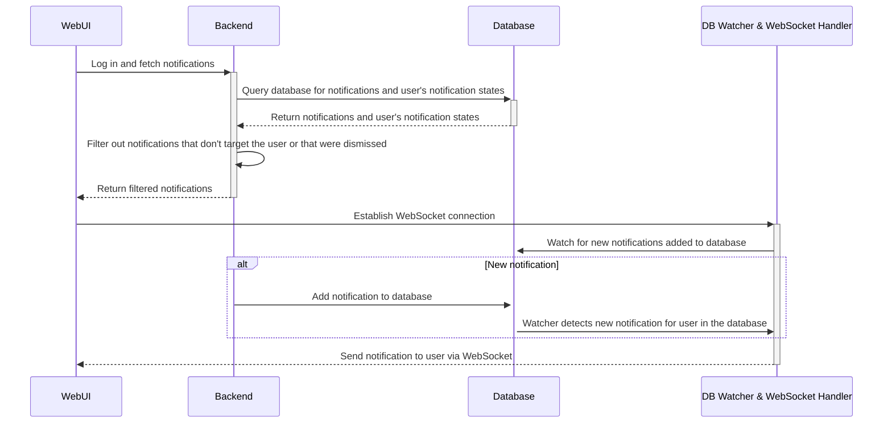

# RFD 0156 - Notifications

## Required Approvals

- Engineering: @zmb3
- Product: @roraback

## What

A notification system that can be used to notify users of various events, updates, and warnings in real time.

## Why

Users currently have no way to easily view or be notified of updates and events relevant to them. Our existing cluster alerts system is cumbersome and doesn't support many
desired use cases due to its non-dynamic nature. With the notification system, features in the application will be able to programmatically send notifications to specific user(s) to
notify them of relevant events. Cluster admins will also be able to manually send informational notifications to their cluster's users.

Examples of potential use cases include being able to notify users of:

- A new access request that needs their review.
- Their access request being approved/denied.
- Needing to complete their periodic access list review.
- An access monitoring alert.
- A failed payment.
- Approaching a usage limit.
- Needing to upgrade their Teleport version.
- New features added to Teleport.

## Details

Notifications will be stored in the backend database and be of two types:

1. User-specific notifications: Targets a single specific user. An example is a notification to notify a user that their access request has been approved.
   These notifications will be stored in the database under the key `/notifications/user/<the user's username>/<notification id>`.
2. Global notifications: Targets multiple users. An example is a notification to notify users that there is a new access request needing review.
   These notifications will be stored in the database under the key `/notifications/global/<notification id>`.
   They can be configured to target users based on one of the following matchers:
   1. Permissions: Targets all users with the specified RBAC permission(s).
   2. Role: Targets all users with the specified role(s).
   3. All: Targets all users.

Since user-specific notifications are stored by username, notifications for SSO users will persist between sessions.

Notifications will have a default TTL of 30 days, after which they will be automatically deleted. In some cases, notifications may also automatically be deleted prior to their TTL, for
example, a notification reminding a user to complete their periodic access list review will be deleted once the user does it.

#### Types and Protos

###### Notification Item

These will be stored under `/notification/user/<username>/<notification id>`. They can also also be nested in a `GlobalNotification`.

```protobuf
// Notification represents a notification item.
message Notification {
   // ID is the unique identifier for the notification.
   string ID = 1 [(gogoproto.jsontag) = "id"];
   // Code is the unique notification code.
   string Code = 2 [(gogoproto.jsontag) = "code"];
   // Title is the title/header of the notification.
   string Title = 3 [(gogoproto.jsontag) = "title"];
   // Description is the text content of the notification.
   string Description = 4 [(gogoproto.jsontag) = "description"];
   // Created is when the notification was created, in UNIX time.
   google.protobuf.Timestamp Created = 5 [(gogoproto.jsontag) = "created"];
   // TTL is how long the notification should last for before automatically expiring. Default is 30 days.
   int64 TTL = 6 [(gogoproto.jsontag) = "ttl,omitempty"];
   // Metadata is optional additional metadata to be added to the notification.
   google.protobuf.Struct Metadata = 7 [(gogoproto.jsontag) = "metadata,omitempty"];
}
```

###### User Notification Preferences Item

Each user will have one `UserNotificationStates` object which will keep track of the notifications they have seen or dismissed.

These will be stored once per user in the database under `/notifications/states/<username>`

```protobuf
// UserNotificationStates represents a user's notification states. This is to keep track
// of the notifications the user has seen and dismissed.
message UserNotificationStates {
   // ReadNotifications is a list of notification IDs that the user has already seen and will be marked as read.
   repeated string ReadNotifications = 1 [(gogoproto.jsontag) = "read_notifications"];
   // DismissedNotifications is a list of notification IDs that the user has chosen to hide. These will be filtered out when notifications are fetched.
   repeated string DismissedNotifications = 2 [(gogoproto.jsontag) = "dismissed_notifications"];
}
```

###### Global Notifications

These will be stored under `/notification/global/<notification id>`.

```protobuf
// GlobalNotification represents a global notification.
message GlobalNotification {
   // Matcher for determining the target of this notification.
   oneof Matcher {
   // ByPermissions represents the RoleConditions needed for a user to receive this notification.
   // If multiple permissions are defined and `MatchAllConditions` is true, the user will need to have
   // all of them to receive this notification.
   repeated RoleConditions ByPermissions = 1 [(gogoproto.jsontag) = "by_permissions"];
   // ByRoles represents the roles targeted by this notification.
   // If multiple roles are defined and `MatchAllConditions` is true, the user will need to have all
   // of them to receive this notification.
   repeated string ByRoles = 2 [(gogoproto.jsontag) = "by_roles"];
   // All represents whether to target all users, regardless of roles or permissions.
   bool All = 3 [(gogoproto.jsontag) = "all"];
   }
   // MatchAllConditions is whether or not all the conditions specified by the matcher must be met,
   // if false, only one of the conditions needs to be met.
   bool MatchAllConditions = 4 [(gogoproto.jsontag) = "match_all_conditions"];
   // Notification is the notification itself.
   Notification Notification = 5 [(gogoproto.jsontag) = "notification"];
}
```

##### Unique Notification Codes

Each notification will have a code identifying the type of notification it is. This is so that we can handle notifications in the UI
differently based on their type, such as determining what action is performed when interacting with it (if any) and which icon it should have, this is
similar to what we do for audit log events.

###### Example codes

```go

// Notification codes for identifying different notification types.
//
//   - Notification codes start with "N" and belong in this const block.
//
//   - Related notifications are grouped starting with the same number.
//     eg: All access request-related notifications are grouped under 1xxx.
//
//   - Suffix each code with one of these letters: A (actionable), I (informational), W (warning).
//
// After defining a notification code, make sure to keep
// `web/packages/teleport/src/services/notifications/types.ts` in sync.
const (
   // DefaultInformationalCode is the default code for an informational notification.
   DefaultInformationalCode = "N0000I"
   // DefaultWarningCode is the default code for a warning notification.
   DefaultWarningCode = "N0000W"

   // ManuallyCreatedInformationalCode is the code for informational notifications that were manually created using `tctl`.
   ManuallyCreatedInformationalCode = "N0001I"
   // ManuallyCreatedWarningCode is the code for warning notifications that were manually created using `tctl`.
   ManuallyCreatedWarningCode = "N0001W"

   // AccessRequestReceivedCode is the code for the notification of a user receiving an access request.
   AccessRequestReceivedCode = "N1000A"
   // AccessRequestApprovedCode is the code for the notification of a user's access request being approved.
   AccessRequestApprovedCode = "N1001A"
   // AccessRequestDeniedCode is the code for the notification of a user's access request being denied.
   AccessRequestDeniedCode = "N1001I"
)
```

For example, if a notification's code is `N1000A`, the UI will make the notification clickable and redirect to the page for reviewing the access request.

#### Usage

The notifications service will work primarily by adding, deleting, and fetching notifications from the database. There will also be a watcher which
watches for any changes to the database in order to perform real-time actions when a new notification is added.

These are some examples of methods of the service which can be called:

```go
// Creates a user-specific notification for a user. This will be stored in the database as a Notification under `/notifications/user/<username>/<notification.id>`.
NotifyUser(username string, notification types.Notification) error

// Creates a global notification that matches users based on the specified role conditions (permissions). This will be stored in the database as a GlobalNotification under `/notifications/global/<notification.id>`.
NotifyUsersByPermissions(roleConditions []types.RoleConditions, notification types.Notification, matchAllConditions bool) error

// Creates a global notification that matches users who have the specified roles. This will be stored in the database as a GlobalNotification under `/notifications/global/<notification.id>`.
NotifyUsersByRole(roles []string, notification types.Notification, matchAllConditions bool) error

// Notifies all users. This will be stored in the database as a GlobalNotification under `/notifications/global/<notification.id>`.
NotifyAllUsers(notification types.Notification) error

// Fetches all notifications for the user, including all matching global notifications.
// This will filter out notifications not meant for the user, as well as notifications the user has manually dismissed.
// During this filtering, any notifications marked for expiry which are identified to be older than 30 days will be deleted from the database.
// Additionally, any notification IDs found in the user's UserNotificationStates for notifications that no longer exist will be removed.
GetNotificationsForUser(user types.User) ([]types.Notification, error)

// Checks if a user matches a global notification's matcher. This will be called by `getNotificationsForUser()` when filtering global notifications.
// This function may include some hard-coded checks for specific cases, for example, to prevent a user from matching a notification to review their own access request.
UserMatchesGlobalNotification(user types.User, types.GlobalNotification) (bool, error)

// Deletes a global notification from the database by deleting `/notifications/global/<notification.id>`
DeleteGlobalNotification(notificationID string) error

// Marks the specified notifications as read for the user by updating the `ReadNotifications` list under `/notifications/states/<username>`.
MarkNotificationsAsRead(username string, notificationIDs []string) error

// Marks the specified notifications as dismissed by updating the `DismissedNotifications` list under `/notifications/states/<username>`.
MarkNotificationsAsDismissed(username string, notificationIDs []string) error
```

##### Example Usage:

```go

// Notifies all users with the permission to `create` and `update` integrations.

roleConditions := []types.RoleConditions{
   {
      Rules: []types.Rule{
         {
            Resources: []string{types.KindIntegration},
            Verbs:     []string{types.VerbCreate, types.VerbUpdate},
         },
      },
   },
}

notification := types.Notification{
   ID: uuid.NewString(),
	Code: notifications.IntegrationMisconfiguredCode,
	Title: "Integration Misconfigured",
	Description: fmt.Sprintf("The integration [%s] was misconfigured.", integration.name),
	Created: time.Now(),
	Metadata: integration,
 }

notifyUsersByPermissions(roleConditions, notification)
```

### Flow

#### Web UI

Upon logging in, a request will be made to fetch all the user's notifications. This fetch is performed asynchronously after the login so that the login process is not slowed down
by having to wait for the notifications response. The backend will query the database and return the list of the user's notifications after filtering out those not meant for them. In
the case of global notifications, only notifications with matchers that match the user (ie. by role or permissions) will be kept. This returned list will be stored in the browser's
local storage until the user logs out. A WebSocket connection will then be established with the backend. Any new notifications will be picked up by the database watcher and, if meant
for the user, will be sent to their client via WebSocket. Since the web session renews every 10 minutes, the WebSocket connection will need to be closed and reopened on every session renewal.

This is a simplified diagram of the flow:



The WebSocket handler will keep track of all active connections using the usernames of the client users. When it receives a new user-specific notification from the database watcher, it will
check if the target user is currently connected, and send the notification to them via WebSocket. If it receives a global notification, it will iterate through the connected clients and send the
notification to those who match the notification's matchers.

###### Notes

This flow is designed to allow for real-time notifications and to limit the number of times a full fetch of the user's notifications from the database needs to be performed, which can be performance heavy.
One limitation of this proposed flow is the case where a user closes all Web UI tabs while still logged in, any new notifications they receive until they open it again won't be received by the UI since
there would be no open WebSocket connection to receive them. One way to mitigate this would be to have the frontend detect whether a newly opened Web UI tab is the only one, and if so, do a
full fetch of the user's notifications.

It should be noted that due to potential time constraints, the initial version of the implementation may not include the WebSocket and database watcher components, and will instead fetch
notifications on every page load.

###### Stretch goal

We could also look into implementing the use of a service worker that can run and listen for notifications even if no tabs are open, this could also work with the [Push API](https://developer.mozilla.org/en-US/docs/Web/API/Push_API) and
[Notifications API](https://developer.mozilla.org/en-US/docs/Web/API/Notifications_API) to send push notifications from the browser. However, this would introduce some potential security-related issues and would require more consideration.

#### tsh

Upon logging in with `tsh`, the user's notifications will be fetched in order to inform them on the post-login status screen whether they have any new unread notifications. Since this fetch can't be performed asynchronously
like in the Web UI, there will be a 1.5-second timeout on it to prevent it from slowing down the login too much in case it takes too long. We currently don't have this timeout for cluster alerts on login, however, it can be
assumed that due to the larger number of notifications and additional filtering, fetching notifications is likely to take longer. This timeout may be adjusted or removed once we have more insight into how long it typically takes.

Running `tsh notifications ls` will fetch all notifications with no timeout.

### UX

Most of the details regarding the UX are still being discussed and have yet to be finalized, they are being tracked in [this GitHub issue](https://github.com/gravitational/cloud/issues/6486). The details proposed below are subject to change.

#### Web UI

The Web UI will feature a notification icon on the top toolbar, if the user has any unread notifications, this icon will have a badge with the number of unread notifications. Clicking this
button will open the notifications pane which will list the user's notifications. After the notifications pane is opened, any previously unread notifications will be marked as read (a request
will also be made to update the database).

Notifications with long descriptions beyond a certain length will be truncated and optionally expandable to show their full content. The user has the option to dismiss a notification which means
that they will never see it again. They can also manually mark a notification as unread. Beyond that, the interactivity of a notification in this list depends on its type which is identified by its [code](#unique-notification-codes),
Informational and warning notifications won't be interactive and will only display their text content. Actionable notifications will be interactive and able to perform an action, for example in the case
of a new access request notification, it can redirect the user to the page where they can review the request (the action any given notification type performs will be manually configured in the Web UI code).

##### Stretch goal

Users will also have the ability to manage their notifications preferences in their settings. Particularly, the ability to mute certain types
of notifications, these will be stored in the user's user preferences.

#### CLI

##### tsh

Upon logging in with `tsh`, the post-login status screen will include how many unread notifications they have, if any, and how to view them. If this initial fetch for notifications times out, they will be shown
a generic message telling them to run `$ tsh notifications ls` to view their notifications.

Notifications can be viewed by running:

```shell
$ tsh notifications ls
```

All notifications listed will be marked as read by the user.

The user can also dismiss a notification using:

```shell
$ tsh notifications dismiss <notification-id>
```

##### tctl

Users with RBAC `write` permissions for the `notifications` resource will be able to manually create notifications to notify users in their cluster using:

```shell
$ tctl notifications create --title=<title> --description=<description> --type=<info | warning> (--all | --roles=<roles-to-target>) --ttl=<ttl>
```

- `--type` is the type of notification, either `info` or `warning`. All this does is determine which icon will be used when showing the notification in the UI.
- `--all` means this notification will target all users.
- `--roles` are the role(s) that this notification should target (ie. `ByRoles`). If multiple roles are specified here, users will only need to have one of the roles to be targeted.
- `--ttl` is the notifications time to live, it will automatically expire and be deleted after this. The default is 30 days.

###### Example usage

```shell
$  tctl notifications create \
   --title="Enroll an MFA device" \
   --description="We will soon be enforcing MFA in our Teleport cluster, please enroll a device to avoid being locked out of your account." \
   --type=info \
   --all \
   --ttl=45d
```

Global notifications can also be deleted using:

```shell
$ tctl notifications delete <notification-id>
```

###### Stretch goal

Support a `--permissions` flag that accepts a predicate expression which will allow cluster admins to also be able target users by permissions.

### Security

The proposed changes don't introduce any new potential vulnerabilities, though it should be noted that there is already a relevant minor issue affecting all WebSocket connections in the UI, which is
being tracked by [this ticket](https://github.com/gravitational/teleport-private/issues/637) and will be remediated with the implementation of [this RFD](https://github.com/gravitational/teleport.e/pull/1609).

Creating a notification using `tctl` is a protected action that requires `write` permissions for the `notifications` resource which users won't have by default. Creating notifications will also be
an [administrative action](https://github.com/gravitational/teleport/blob/master/rfd/0131-adminitrative-actions-mfa.md) and require an additional MFA re-authentication. This prevents an unauthorized bad actor from creating a malicious notification, such as to phish users.

Programmatically generated notifications will not store or expose any sensitive information, and the documentation for the `tctl` command should also recommend users to not create notifications containing any sensitive information. This prevents any
potential risks that would be introduced by storing notifications in the browser's persisting local storage.

### Backwards Compatibility and Leaf Clusters

##### Cluster Alerts

The notification system will replace the existing cluster alerts system. When this feature is released, creating new cluster alerts will no longer be supported.
To ease the UX transition, any existing cluster alerts created prior to this change will continue to be supported and behave the same way for two major releases; after which
all cluster alert functionality will be removed.

##### Leaf Clusters

Notifications between root and leaf clusters won't be initially supported and will be unique to each cluster. This can be explored as a stretch goal.

### Audit Events

Audit events will be emitted upon the manual creation and deletion of global notifications via `tctl`, they will contain the name of the user who created the notification, as well as
the notification's content.

### Test Plan

Under all the test plan sections for features that emit notifications, items will be added to verify that the notifications are emitted correctly. Cluster alert-related test plan items should be removed.

The `tctl notifications create` and `delete` commands should also be tested.
