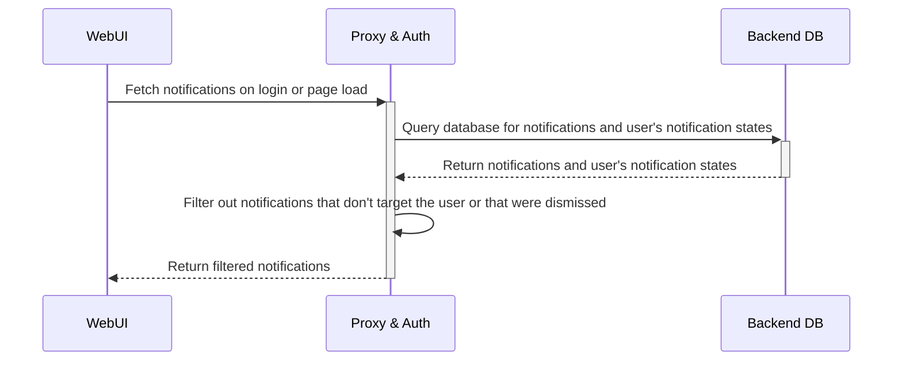

# RFD 0156 - Notifications

## Required Approvals

- Engineering: @zmb3
- Product: @roraback

## What

A notification system that can be used to notify users of various events, updates, and warnings in real time.

## Why

Users currently have no way to easily view or be notified of updates and events relevant to them. Our existing cluster alerts system is cumbersome and doesn't support many
desired use cases due to its non-dynamic nature. With the notification system, features in the application will be able to programmatically send notifications to specific user(s) to
notify them of relevant events. Cluster admins will also be able to manually send informational notifications to their cluster's users.

Examples of potential use cases include being able to notify users of:

- A new access request that needs their review.
- Their access request being approved/denied.
- Needing to complete their periodic access list review.
- An access monitoring alert.
- A failed payment.
- Approaching a usage limit.
- Needing to upgrade their Teleport version.
- New features added to Teleport.

## Details

Notifications will be stored in the backend database and be of two types:

1. User-specific notifications: Targets a single specific user. An example is a notification to notify a user that their access request has been approved.
2. Global notifications: Targets multiple users. An example is a notification to notify users that there is a new access request needing review.
   They can be configured to target users based on one of the following matchers:
   1. Permissions: Targets all users with the specified RBAC permission(s).
   2. Role: Targets all users with the specified role(s).
   3. All: Targets all users.

Since user-specific notifications are stored by username, notifications for SSO users will persist between sessions.

Notifications will have a default TTL of 30 days, after which they will be automatically deleted. In some cases, notifications may also automatically be deleted prior to their TTL if configured to do so.

#### Backend Database

User-specific notifications will be stored in the backend under the key `/notifications/user/<auth connector>/<the user's username>/<notification id>`.

We include the `auth connector` in the key to prevent the edge case where a SSO user has the same username as a local user (or a user using another auth connector), this would cause the users' notifications to be merged.

Global notifications will be stored in the backend under the key `/notifications/global/<notification id>`.

There will be a hard cap of the number of notifications which can exist at any given time per key-space, the limit for any given user's user-specific notifications will be 500, and global notifications will be capped at 1000.
If a new notification is added beyond this point, it will delete and replace the oldest existing notification in the key-space.

#### Types and Protos

###### Notification Item

If this is a user-specific notification, it will be stored as-is under `/notification/user/<auth connector>/<username>/<notification id>`.

If this is a global notification, it will be nested in a [`GlobalNotification`](#global-notifications).

```protobuf
// Notification represents a notification item.
message Notification {
   // kind is the resource kind ("notification").
   string kind = 1;
   // sub_kind is the optional resource subkind. This is unused.
   string sub_kind = 2;
   // version is the resource version.
   string version = 3;
   // id is the UUID of the notification, in UUIDv7 format.
   string id = 4;
   // type represents the unique type of notification this is, eg. `access-request-approved`.
   string type = 5;
   // metadata is the notification's metadata. This contains the notification's title, description and labels.
   Metadata metadata = 6;
   // created is when the notification was created, in UNIX time.
   google.protobuf.Timestamp created = 7;
   // ttl is how long the notification should last before expiring. This will default to 30 days if left empty.
   google.protobuf.Duration ttl = 7;
}
```

###### User Notification State Item

Each user will have a unique `NotificationState` item for every notification they have interacted with.

This will keep track of whether the user has viewed (clicked on) or dismissed the notification.

These will be stored per user per notification in the backend under `/notification/states/<auth connector>/<username>/<notification id>`

Dismissed states are only going to be possible for global notifications. If a user dismisses a user-specific notification directed at them, instead of updating this state to `dismissed`, the notification will just be
deleted as well as its state item.

```protobuf
// UserNotificationState represents a notification's state for a user. This is to keep track
// of whether the user has viewed or dismissed the notification.
message UserNotificationState {
   // kind is the resource kind ("user_notification_state").
   string kind = 1;
   // sub_kind is the optional resource subkind. This is unused.
   string sub_kind = 2;
   // version is the resource version.
   string version = 3;
   // notification_state is the state of this notification for the user. This can be either "viewed" or "dismissed".
   NotificationState notification_state = 4;
}

enum NotificationState {
   // NOTIFICATION_STATE_VIEWED marks this notification has having been viewed (clicked on) by the user.
   NOTIFICATION_STATE_VIEWED = 0;
   // NOTIFICATION_STATE_DISMISSED marks this notification has having been dismissed by the user.
   NOTIFICATION_STATE_DISMISSED = 1;
}
```

##### User Last Seen Notification Item

This keeps track of the timestamp of the latest notification the user has seen in their notifications list. This is used in order to determine whether
the user has any new notifications since then that they haven't seen yet. Note that "seeing" a notification merely refers to seeing it in the list, this is different from "viewing"
a notification which involves clicking on it.

This will be stored once per user in the backend under `/notifications/last_seen/<auth connector>/<username>`.

```protobuf
// UserLastSeenNotification represents the timestamp of the last notification that they have seen.
message UserLastSeenNotification  {
   // kind is the resource kind ("user_notification_state").
   string kind = 1;
   // sub_kind is the optional resource subkind. This is unused.
   string sub_kind = 2;
   // version is the resource version.
   string version = 3;
   // last_seen_time is the timestamp of the last notification that the user has seen.
   google.protobuf.Timestamp last_seen_time = 4;
}
```

###### Global Notification Item

These will be stored under `/notification/global/<notification id>`.

```protobuf
// GlobalNotification represents a global notification.
message GlobalNotification {
   // kind is the resource kind ("user_notification_state").
   string kind = 1;
   // sub_kind is the optional resource subkind. This is unused.
   string sub_kind = 2;
   // version is the resource version.
   string version = 3;
   // Matcher for determining the target of this notification.
   oneof matcher {
      // by_permissions represents the RoleConditions needed for a user to receive this notification.
      // If multiple permissions are defined and `MatchAllConditions` is true, the user will need to have
      // all of them to receive this notification.
      ByPermissions by_permissions = 4;
      // by_roles represents the roles targeted by this notification.
      // If multiple roles are defined and `MatchAllConditions` is true, the user will need to have all
      // of them to receive this notification.
      ByRoles by_roles = 5;
      // all represents whether to target all users, regardless of roles or permissions.
      bool all = 6;
   }
   // match_all_conditions is whether or not all the conditions specified by the matcher must be met,
   // if false, only one of the conditions needs to be met.
   bool match_all_conditions = 7;
   // notification is the notification itself.
   Notification notification = 8;
}

// ByPermissions represents the RoleConditions needed for a user to receive this notification.
message ByPermissions {
   repeated RoleConditions role_conditions = 1;
}

// ByRoles represents the roles targeted by this notification.
message ByRoles {
   repeated string roles = 1;
}
```

##### Unique Notification Types

Each notification will have a type identifying the type of notification it is. This is so that we can handle notifications in the UI
differently based on their type, such as determining what action is performed when interacting with it and which icon it should have.

###### Example types

```go
// Notification typess for identifying different notification types.
//
// Notifications related to the same feature should be grouped together and follow the same naming pattern.
//
// After defining a notification type, make sure to keep
// `web/packages/teleport/src/services/notifications/types.ts` in sync.
const (
   // DefaultInformationalType is the default type for an informational notification.
   DefaultInformationalType = "default-informational"
   // DefaultWarningType is the default type for a warning notification.
   DefaultWarningType = "default-warning"

   // UserCreatedInformationalType is the type for informational notifications that were manually created by a user using `tctl`.
   UserCreatedInformationalType = "user-created-informational"
   // UserCreatedWarningType is the type for warning notifications that were manually created by a user using `tctl`.
   UserCreatedWarningType = "user-created-warning"

   // AccessRequestPendingType is the type for the notification of an access request pending review. This is the notification received
   // by a user when an access request needs their review.
   AccessRequestPendingType = "access-request-pending"
   // AccessRequestApprovedType is the type for the notification of a user's access request being approved.
   AccessRequestApprovedType = "access-request-approved"
   // AccessRequestDeniedType is the type for the notification of a user's access request being denied.
   AccessRequestDeniedType = "access-request-denied"
)
```

For example, if a notification's type is `access-request-pending`, the UI will make the notification redirect to the page for reviewing the access request.

#### Usage

The notifications service will work primarily by adding, deleting, and fetching notifications from the backend. There will also be a watcher which
watches for any changes to the database in order to perform real-time actions when a new notification is added.

These are some examples of methods of the service which can be called:

```go
// Creates a user-specific notification for a user. This will be stored in the backend as a Notification under `/notifications/user/<auth connector>/<username>/<notification.id>`.
// Will also set any unset defaults such as the UUID, Created date, and ttl.
NotifyUser(ctx context.Context, username string, notification types.Notification) error

// Creates a global notification that matches users based on the specified role conditions (permissions). This will be stored in the backend as a GlobalNotification under `/notifications/global/<notification.id>`.
// Will also set any unset defaults such as the UUID, Created date, and ttl.
NotifyUsersByPermissions(ctx context.Context, roleConditions []types.RoleConditions, notification types.Notification, matchAllConditions bool) error

// Creates a global notification that matches users who have the specified roles. This will be stored in the backend as a GlobalNotification under `/notifications/global/<notification.id>`.
// Will also set any unset defaults such as the UUID, Created date, and ttl.
NotifyUsersByRole(ctx context.Context, roles []string, notification types.Notification, matchAllConditions bool) error

// Notifies all users. This will be stored in the backend as a GlobalNotification under `/notifications/global/<notification.id>`.
// Will also set any unset defaults such as the UUID, Created date, and ttl.
NotifyAllUsers(ctx context.Context, notification types.Notification) error

// Fetches all notifications for the user, including all matching global notifications.
// This will filter out notifications not meant for the user, as well as notifications the user has manually dismissed.
// During this filtering, any notifications marked for expiry which are identified to be older than 30 days will be deleted from the backend.
// Additionally, any notification IDs found in the user's UserNotificationState for notifications that no longer exist will be removed.
GetNotificationsForUser(ctx context.Context, user types.User) ([]types.Notification, error)

// Checks if a user matches a global notification's matcher. This will be called by `getNotificationsForUser()` when filtering global notifications.
// This function may include some hard-coded checks for specific cases, for example, to prevent a user from matching a notification to review their own access request.
UserMatchesGlobalNotification(ctx context.Context, user types.User, types.GlobalNotification) (bool, error)

// Deletes a global notification from the backend by deleting `/notifications/global/<notification.id>`
DeleteGlobalNotification(ctx context.Context, notificationID string) error

// Sets the timestamp of the last notification a user has seen by updating the `UserLastSeenNotification` under `/notifications/last_seen/<auth connector>/<username>`
SetUserLastSeenNotification(ctx context.Context, username string, timestamp time.Time)

// Marks the specified notification as viewed for the user by setting the `UserNotificationState` under `/notification/states/<auth connector>/<username>/<notification id>` to `viewed`.
MarkNotificationAsViewed(ctx context.Context, username string, notificationID string) error

// Marks the specified notification as dismissed for the user by setting the `UserNotificationState` under `/notification/states/<auth connector>/<username>/<notification id>` to `dismissed`.
// If the notification is user-specific, this deletes the notification and the notification state.
MarkNotificationAsDismissed(ctx context.Context, username string, notificationID string) error
```

##### Example Usage:

```go

// Notifies all users with the permission to `create` and `update` integrations.

roleConditions := []types.RoleConditions{
   {
      Rules: []types.Rule{
         {
            Resources: []string{types.KindIntegration},
            Verbs:     []string{types.VerbCreate, types.VerbUpdate},
         },
      },
   },
}

notification := types.Notification{
   Type: notifications.IntegrationMisconfiguredType,
   Metadata: types.Metadata{
      Name: "Integration Misconfigured",
      Description: fmt.Sprintf("The integration [%s] was misconfigured.", integration.name),
      Labels:      map[string]string{"integration-id": integration.id},
   },
}

notifyUsersByPermissions(roleConditions, notification)
```

### Flow

#### Web UI

Upon logging in and on every page load, a request will be made to fetch all the user's notifications. This fetch will be performed asynchronously so that the login or page loading process is not slowed down by having to wait for the notifications response.
The notifications service will query the database and return the list of the user's notifications after filtering out those not meant for them. In the case of global notifications, only notifications with matchers that match the user (ie. by role or
permissions) will be kept. Notifications that the user dismissed will also be filtered out.

This is a simplified diagram of the flow:



###### Stretch goal

In the future, we can implement the use of WebSockets alongside a database watcher in order to allow for real-time notifications, this would work by only performing one initial fetch on login for all notifications and storing them in `localStorage`,
then, any new notifications received during the user's session will be sent to the user's browser in real-time via a WebSocket connection.

We could also look into implementing the use of a service worker that can run and listen for notifications even if no tabs are open, this could also work with the [Push API](https://developer.mozilla.org/en-US/docs/Web/API/Push_API) and
[Notifications API](https://developer.mozilla.org/en-US/docs/Web/API/Notifications_API) to send push notifications from the browser. However, this would introduce some potential security-related issues and would require more consideration.

#### tsh

The first version will not include `tsh` support for notifications. This can be explored in the future, and would likely be limited to a `tsh notifications ls` command for listing notifications.

### UX

Most of the details regarding the UX are still being discussed and have yet to be finalized, they are being tracked in [this GitHub issue](https://github.com/gravitational/cloud/issues/6486). The details proposed below are subject to change.

#### Web UI

The Web UI will feature a notification icon on the top toolbar, if the user has any unread notifications, this icon will have a badge with the number of unread notifications. Clicking this
button will open the notifications pane which will list the user's notifications. After the notifications pane is opened, any previously unread notifications will be marked as read (this is done by making a request
which updates the user's last seen notification timestamp). Any notification that has not yet been viewed (clicked on) will be highlighted to differentiate it from the rest.

Notifications with long descriptions beyond a certain length will be truncated and optionally expandable to show their full content. The user has the option to dismiss a notification which means
that they will never see it again. The interactivity of a notification in this list depends on its type which is identified by its [type](#unique-notification-types). Informational and warning notifications (such as those created manually via `tctl`)
will be clickable and open a modal with the full text content. Other notifications can be interactive and able to perform specific actions, for example in the case of a new access request notification, it can redirect the user to the page where they can
review the request (the action any given notification type performs will be manually configured in the Web UI code). Notifications may also have a "quick action" beyond just being clickable, for example, in the case of a notification for an approved access request,
there may be a quick action button to assume the new roles. Interacting with a notification will mark it as viewed.

##### Stretch goal

Users will also have the ability to manage their notifications preferences in their settings. Particularly, the ability to mute certain types
of notifications, these will be stored in the user's user preferences. This may not be included in the first version.

#### CLI

##### tctl

Users with RBAC `write` permissions for the `notifications` resource will be able to manually create notifications to notify users in their cluster using:

```shell
$ tctl notifications create --title=<title> --description=<description> --type=<info | warning> (--all | --roles=<roles-to-target>) --ttl=<ttl>
```

- `--type` is the type of notification, either `info` or `warning`. All this does is determine which icon/colors will be used when showing the notification in the UI.
- `--all` means this notification will target all users.
- `--roles` are the role(s) that this notification should target (ie. `ByRoles`). If multiple roles are specified here, users will only need to have one of the roles to be targeted.
- `--ttl` is the notification's time to live, it will automatically expire and be deleted after this. The default is 30 days.

###### Example usage

```shell
$  tctl notifications create \
   --title="Enroll an MFA device" \
   --description="We will soon be enforcing MFA in this cluster, please enroll a device to avoid being locked out of your account." \
   --type=info \
   --all \
   --ttl=45d
```

Global notifications can also be deleted using:

```shell
$ tctl notifications delete <notification-id>
```

###### Stretch goal

Support a `--permissions` flag that accepts a predicate expression which will allow cluster admins to also be able to target users by permissions.

### Security

The proposed changes don't introduce any new potential vulnerabilities, though it should be noted that there is already a relevant minor issue affecting all WebSocket connections in the UI, which is
being tracked by [this ticket](https://github.com/gravitational/teleport-private/issues/637) and will be remediated with the implementation of [this RFD](https://github.com/gravitational/teleport.e/pull/1609).

Creating a notification using `tctl` is a protected action that requires `write` permissions for the `notifications` resource which users won't have by default. Creating notifications will also be
an [administrative action](https://github.com/gravitational/teleport/blob/master/rfd/0131-adminitrative-actions-mfa.md) and require an additional MFA re-authentication. This prevents an unauthorized bad actor from creating a malicious notification, such as to phish users.

Programmatically generated notifications will not store or expose any sensitive information, and the documentation for the `tctl` command should also recommend users to not create notifications containing any sensitive information. This prevents any
potential risks that would be introduced by storing notifications in the browser's persisting local storage.

### Backwards Compatibility and Leaf Clusters

##### Cluster Alerts

The notification system will replace the existing cluster alerts system. When this feature is released, creating new cluster alerts will no longer be supported.
To ease the UX transition, any existing cluster alerts created prior to this change will continue to be supported and behave the same way for two major releases; after which
all cluster alert functionality will be removed. During this time, attempts to run any cluster alert-related commands will be met with a message informing them that the feature is deprecated
and that they should use notifications, alongside a basic usage example.

##### Leaf Clusters

Notifications will be unique to each cluster. However, similar to the behaviour of cluster alerts today, notifications in a leaf cluster will be accessible from the root cluster.
When a user in the Web UI switches to the leaf cluster, their notifications list will be listing those from the leaf cluster. We can possibly include some type of indicator in the notifications pane in the Web UI to make this clear.

### Audit Events

Audit events will be emitted upon the manual creation and deletion of global notifications via `tctl`, they will contain the name of the user who created the notification, as well as
the notification's content.

### Test Plan

Under all the test plan sections for features that emit notifications, items will be added to verify that the notifications are emitted correctly. Cluster alert-related test plan items should be removed.

The `tctl notifications create` and `delete` commands should also be tested.
